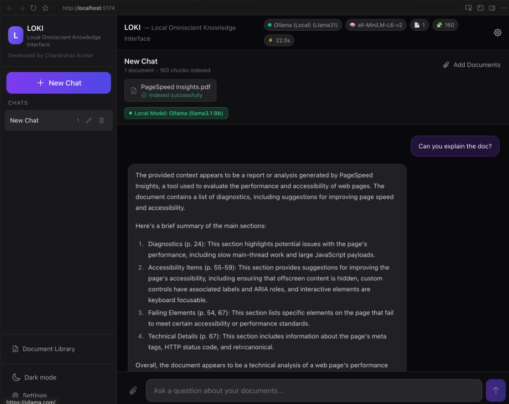
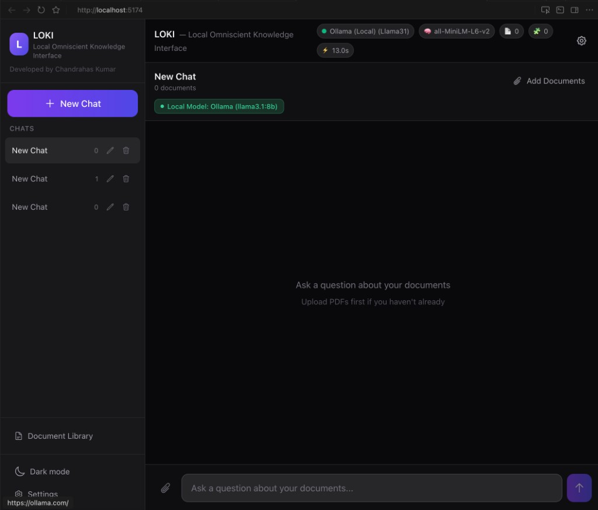
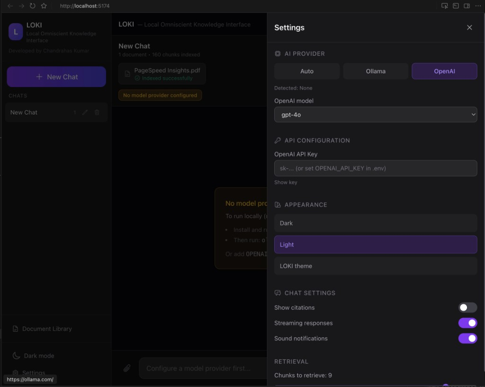
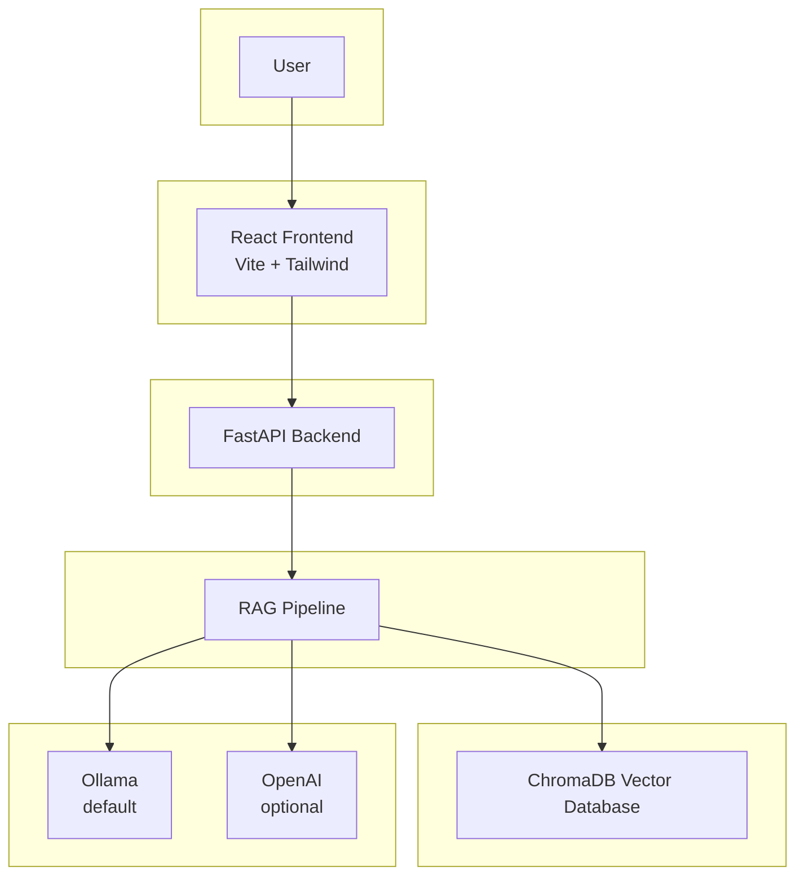

# LOKI — Local Omniscient Knowledge Interface

   

**Local-first AI knowledge assistant for querying documents using Retrieval-Augmented Generation (RAG).**

> Runs fully locally with Ollama — no API key required.

---

## Why LOKI?

Many AI assistants require sending documents to cloud APIs, which raises privacy concerns for sensitive or proprietary content. LOKI takes a **local-first** approach: your documents stay on your machine, and inference runs locally with Ollama—no API key needed. You can use it offline. Optional OpenAI integration is available if you prefer cloud inference. Answers are grounded in your documents with **transparent source citations**, so you can verify where information comes from.

---

## Key Features

- Upload PDFs and build a personal knowledge base
- Ask questions in natural language
- Retrieval-Augmented Generation with document grounding
- Source citations for answers
- Runs locally using Ollama (no API key required)
- Optional OpenAI integration
- Multi-chat workspaces with document isolation
- Modern React + FastAPI architecture

---

## Demo

**Workflow:**

1. **Upload PDFs to a chat workspace** — Create or open a chat, then upload your documents.
2. **Ask questions in natural language** — Type your question in the chat interface.
3. **Receive answers grounded in document context with citations** — Answers are based on your documents, with source references you can follow.







---

## System Architecture



| Layer | Description |
|-------|-------------|
| **React Frontend** | Handles the chat interface, document uploads, and user interaction. |
| **FastAPI Backend** | Exposes REST APIs for chat management, document ingestion, and query processing. |
| **RAG Pipeline** | Processes documents, generates embeddings, retrieves relevant chunks, and constructs prompts. |
| **ChromaDB** | Stores vector embeddings for document retrieval. |
| **LLM Layer** | Uses Ollama by default for local inference, with optional OpenAI support. |

---

## Setup

### 1. Install Ollama (default LLM)

Download from [ollama.com](https://ollama.com), then:

```bash
ollama pull llama3
```

### 2. Clone and install

```bash
git clone https://github.com/Chandrahas-kumar/rag-knowledge-assistant
cd rag-knowledge-assistant

python -m venv venv
source venv/bin/activate   # Windows: venv\Scripts\activate
pip install -r requirements.txt
```

### 3. Run the app (both required)

**Terminal 1 — Backend:**
```bash
uvicorn api.main:app --reload
```

**Terminal 2 — Frontend:**
```bash
cd frontend
npm install
npm run dev
```

### 4. Open in browser

**http://localhost:5174**

> ⚠️ Both backend and frontend must be running. If the UI shows "Connecting..." in the header, the backend is not reachable.

---

## API Endpoints

| Method | Endpoint | Description |
|--------|----------|-------------|
| GET | `/api/chats` | List chats |
| POST | `/api/chats` | Create chat |
| PATCH | `/api/chats/{id}` | Rename chat |
| DELETE | `/api/chats/{id}` | Delete chat |
| GET | `/api/chats/{id}/documents` | List documents |
| POST | `/api/chats/{id}/documents` | Upload documents |
| DELETE | `/api/chats/{id}/documents/{doc_id}` | Remove document |
| POST | `/api/chats/{id}/query` | RAG query |
| GET | `/api/system/status` | System status |
| GET/PUT | `/api/settings` | App settings |

---

## OpenAI (Optional)

To use OpenAI instead of Ollama:

1. Create `.env` from `.env.example`
2. Add `OPENAI_API_KEY=sk-...` and `LLM_PROVIDER=openai`
3. Or configure in the app Settings panel

---

## Project Structure

```
rag-knowledge-assistant/
├── api/
│   └── main.py           # FastAPI backend
├── frontend/             # React + Vite + Tailwind
├── rag_utils.py          # RAG pipeline
├── chat_metadata.json    # Chat metadata
├── app_settings.json     # User settings
├── my_vector_db/         # ChromaDB
├── requirements.txt
└── README.md
```

---

## Tech Stack

| Component | Technology |
|-----------|------------|
| Frontend | React, Vite, Tailwind |
| Backend | FastAPI |
| Vector DB | ChromaDB |
| Embeddings | ONNX / Ollama |
| LLM | Ollama (default) / OpenAI (optional) |

---

## Future Improvements

Roadmap of potential enhancements for LOKI:

- **Support additional document formats (DOCX, Markdown, HTML)** — Broaden the types of content users can ingest without manual conversion.
- **Streaming responses for faster chat experience** — Stream LLM tokens as they’re generated so answers appear incrementally and feel more responsive.
- **Hybrid retrieval (keyword + vector search)** — Combine semantic and keyword search to improve recall for exact terms and synonyms.
- **Multi-user support** — Isolate chats and documents per user or team, with optional auth and permissions.
- **Cloud deployment option** — One-click or documented deploy to a cloud provider for shared or production use.
- **Document summarization** — Auto-summarize long docs or chat threads to speed up orientation and reuse.
- **Conversation memory improvements** — Better use of prior turns (e.g. summarization or selective context) for longer, coherent threads.
- **Embedding model selection** — Let users pick embedding models (e.g. size vs quality) to match hardware and accuracy needs.
- **Role-based knowledge access** — Restrict which documents or collections each user/role can query for compliance and privacy.

---

**Developed by Chandrahas Kumar**

*AI product prototype exploring local-first RAG systems.*
